--- 
title : "[우아한테크코스] 8기 BE 프리코스 1주차 회고"
date: '2025-11-12'
author: 김도현
categories : 회고
tags: 우아한테크코스 java
slug: "review_week1_uteco8th_precourse"
---

다른 사람들보다 한 달은 늦은 회고를 작성하고자 한다. 과제를 제출하면서 소감을 제출하지만 내가 고민한 것을 정리하기 위해 블로그 회고는 조금의 시간을 두고 작성했다.

먼저 우테코 8기 프리코스는 1-3주차에 주차별 과제를 해결하는 것과 4-5주차 통틀어서 오픈 미션을 진행하는 것으로 나뉜다. 1주차 과제는 다음과 같다.

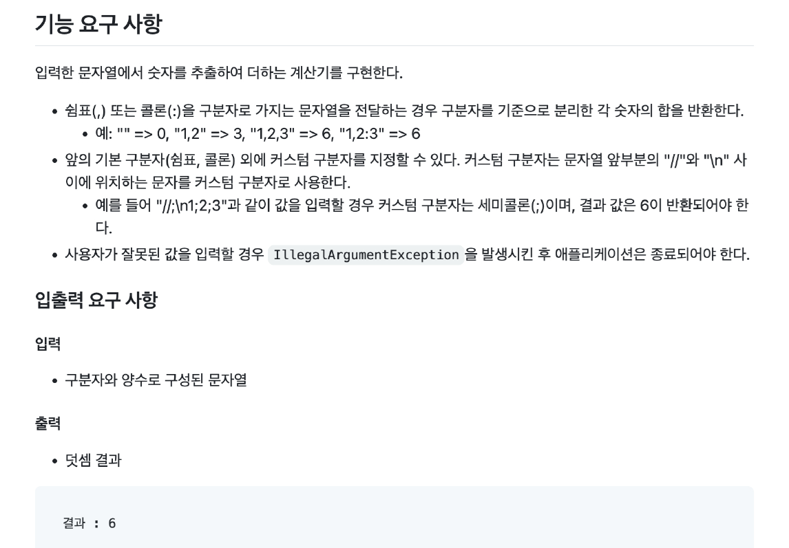

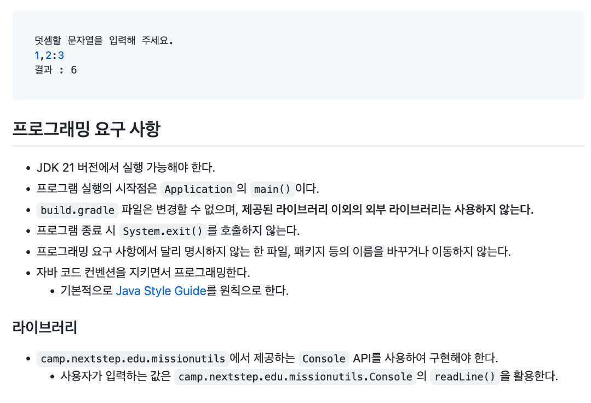

첫 과제이므로 개발 환경에 익숙해지는 것이 큰 목표였다. 

과제의 큰 흐름은 github에서 과제 레포지토리를 fork하고 로컬 환경에 clone하여 개인 브랜치에서 과제를 수행한 후, 기능 단위로 commit하고 최종적으로 과제 레포지토리에 Pull Request하는 것이다. 이 과정은 동아리에서 프로젝트 사전 스터디하며 배운 내용이라 크게 어렵지 않았다.

### 1주차 목표

과제 내용과는 별개로, 프리코스 1주차 과제에 대한 나만의 목표는 다음과 같았다.

- [ ]  자바 프로그래밍 실력을 키울 것
- [ ]  과제를 생성형 AI를 써서 해결하지 말 것
- [ ]  과제에 최선을 다할 것

나는 프로그래밍 공부를 시작한지 오래되지 않아서 자바에 대해서 많이 미숙했다. 백준 문제를 풀어본 적은 있으나 브론즈~실버5 정도였고 그것도 파이썬으로 구현한 것이 전부였기 때문에, 이번 프리코스를 진행하면서 코딩테스트와 함께 자바 프로그래밍 실력을 키우기록 했다.

또한, 많은 영역에서 생성형 AI의 도움을 받았는데, 돌이켜보면 이것을 사용해 코딩하는 경우는 내 실력을 키우는데 도움되지는 않았다. 단기적으로는 분명한 효율을 자랑했으나 학습면에서는 독이 되는 느낌이다. 따라서 이번 우아한 테크코스 과제에서는 최대한 지양하려고 한다. (다만 피드백과 같은 형태는 받으려고 했다.)

마지막으로 우테코 프리코스에 최선을 다하는 것이다. 물론 막학기에 18학점을 들으며 병행하는 것은 쉬운 일이 아니지만 그 남는 시간에도 최대한 참여하고자 했다. 이것이 “몰입”하는데 가장 좋다고 느꼈기 때문이다.

# 과제 수행

가장 먼저 과제를 읽고 TODO를 단계별, 계층별로 작성했다. 이는 과제 가이드에도 있는 것이지만 TODO 작성은 일상에서도 할 정도 정도로 중요하게 생각한다.

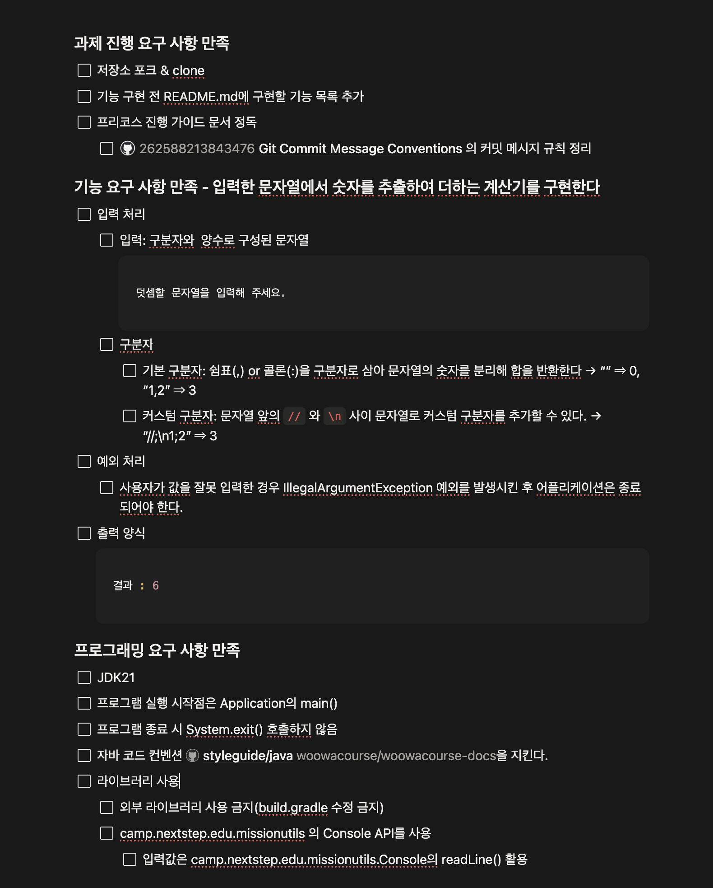

그 다음엔 자바 컨벤션 문서를 확인했다. 1주차에 확인했지만 이 컨벤션에 익숙한 사람은 내 코드를 보고 바로 알겠지만 적용하지는 못했다. 평소에 쓰던 습관을 바로 제거할 수는 없었지만 한 주가 지날 때마다 개선하려고 노력했다.

자바 스타일 컨벤션 문서는 한글로 번역한 사람이 있어 이 문서를 봤다.

[https://github.com/JunHoPark93/google-java-styleguide](https://github.com/JunHoPark93/google-java-styleguide)

그리고 코드 구현 아이디어를 작성하고 슈도 코드를 작성해봤다.

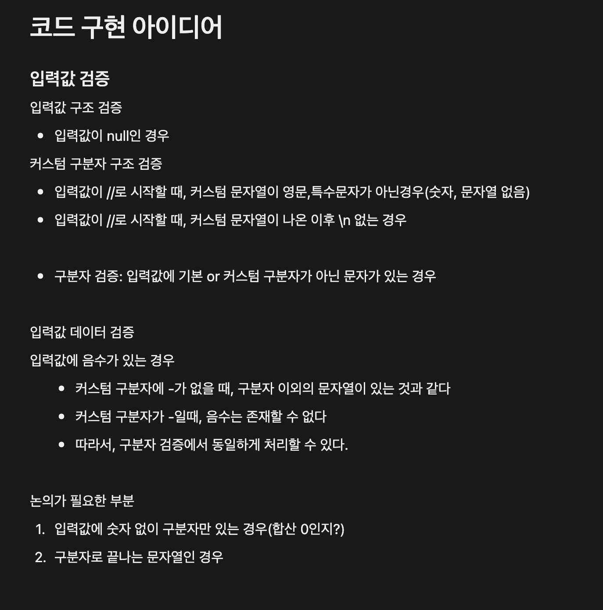

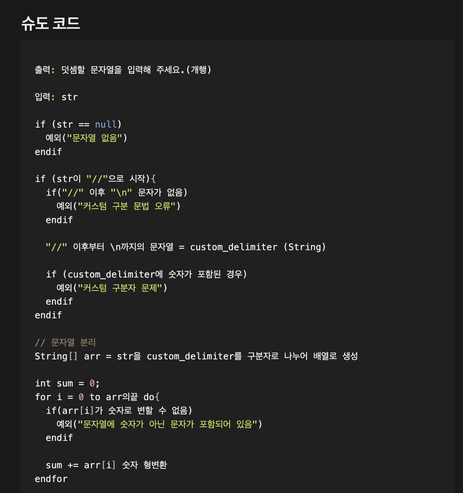

## 트러블슈팅

### indexOf 문자열 문제

슈도 코드를 작성하고 단계에 맞게 코드를 작성하던 중 커스텀 구분자의 끝을 알리는 인덱스를 얻을 수 없는 문제가 생겼다.

```java
if(str.startsWith("//")) {
		int endIndexOfDelimiter = str.indexOf("\n");
```

예를 들어 입력값이 `//m\n` 이라면, \n의 index를 찾아 2부터 index전까지의 문자열을 잘라내 커스텀 구분자로 저장한다. 하지만, indexOf함수를 사용한 결과 계속 -1을 반환하고 있었다.

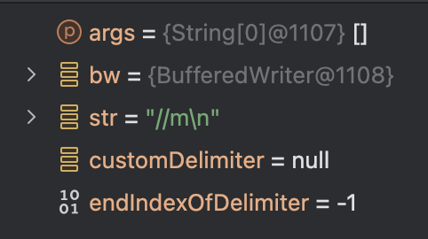

처음에는 어떤 곳에서 문제가 발생하는지 전혀 감을 잡지 못했다. 특정 문제가 발생해도 그 문제에 대한 예외 처리가 적절히 이루어지지 않았기 떄문이다. 그러던 중에 위의 디버깅을 통해 의심되는 지점을 찾았다. 원인은 indexOf로 찾으려는 문자가 “\n”였기 때문이다. 이스케이프 문자열이므로 “\\n”을 써야만 했다. 아마도 이 점을 노리고 조건으로 걸었던 것 같았다.

과제를 진행하면서 코드를 기능 단위로 나누어 테스트하며 개발했는데, 덕분에 이 문제는 빠르게 테스트 → 오류 발견 → 디버깅 의 과정을 거쳐 해결했다.

### 정규표현식의 특수 문자 문제

정규 표현식에는 .이나 * 같은 문자가 역할을 갖는다. 그런데 이때 커스텀 구분자를 .이나 *으로 설정하는 경우 문제가 발생한다.

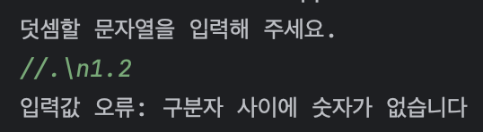

이때, 특수문자가 포함된 문자열도 일반문자열로 인식하도록 만드는 Pattern.quote() 메서드를 사용했다. 문자열 앞 뒤에 \Q, \E 를 넣는 방식이라고 한다.

### 예기치 못한 오류로 인하여 실행에 실패하였습니다.

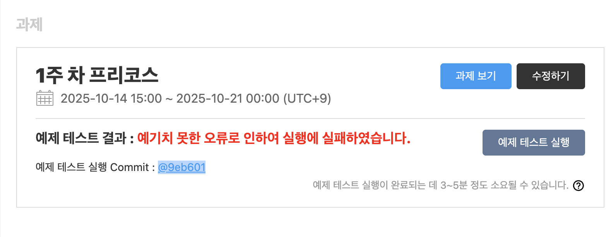

로컬에서 실행하고 테스트하는 데에는 아무런 문제가 없었기 때문에 방심한 면이 있었다. 하지만 나에게도 빌드 오류라는 문제가 발생했다.

처음에는 초기 커밋을 따라갔기 때문에 시간이 지나면 해결될 줄 알았으나 그렇지는 않았다.

먼저 다른 사람들은 이 문제를 어떻게 겪었고 해결했는지 찾아봤다.

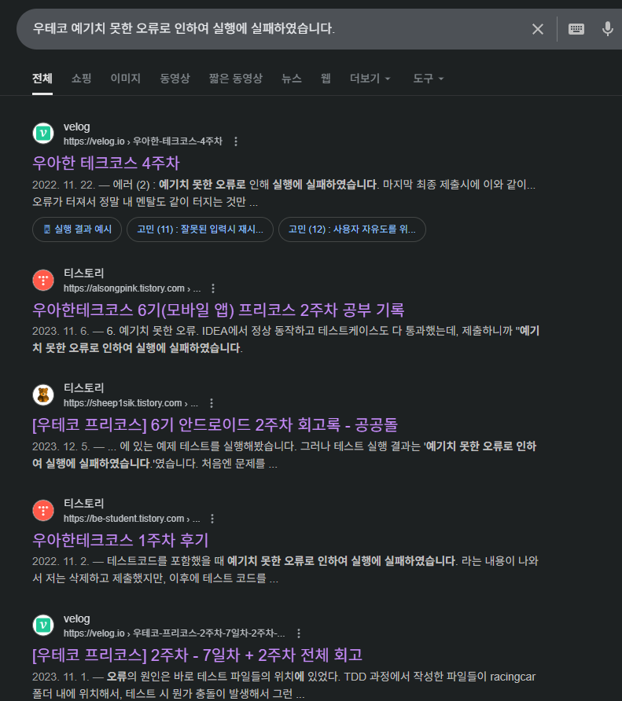

다들 각자의 문제로 예기치 못한 오류가 발생했다. 제공된 기존의 코드 패키지를 변경하거나 for문의 반복 횟수를 구할때 등이다.

해당 원인들은 지금 나와는 거리가 멀다고 생각하여 결국 하나하나 코드를 뜯어보기 시작했다.

그리고 찾은 답은 이것이었다.

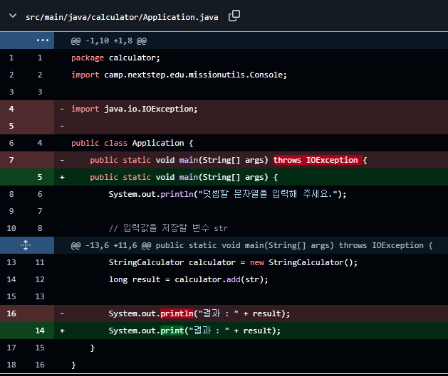

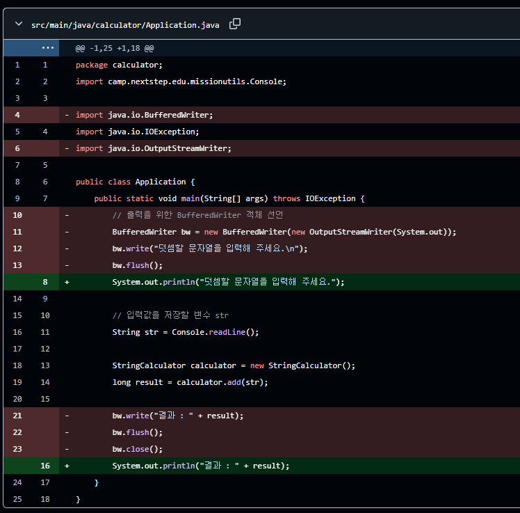

결과적으로 main 실행 시 IOException을 던지는 구문이 기본 코드에 없었는데, 이것이 문제가 되었다. 이 예외를 main에서 처리하게 된 이유는 다름아닌 `BufferedWriter`… 코테에서 자주 사용하므로 자연스럽게 썼는데 마지막에 이게 문제가 되었다. print로 메서드를 변경하고 예외 처리를 없애면서 해결했다.

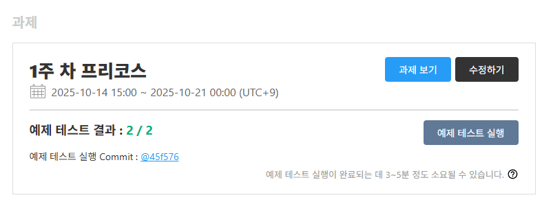

## 1주차 피드백

해당 주차의 과제가 끝난 뒤부터는 커뮤니티에서 공개적으로 과제에 대해 이야기할 수 있다. 나는 4명이서 프리코스 스터디를 하고 있는데, 매주 온라인으로 각자의 해결 아이디어와 구현 방법을 소개하고 서로 피드백을 나누는 시간을 가졌다.

사실 지금와서 1주차 코드를 보면 정말 부끄럽다. (어쩌면 빠르게 성장했다는 것이라고 할 수 있겠지만) 모든 기능을 하나의 클래스에서 처리하는 구조로, 이 부분에 대해서 많은 피드백을 받았다.

[https://github.com/woowacourse-precourse/java-calculator-8/pull/624](https://github.com/woowacourse-precourse/java-calculator-8/pull/624)

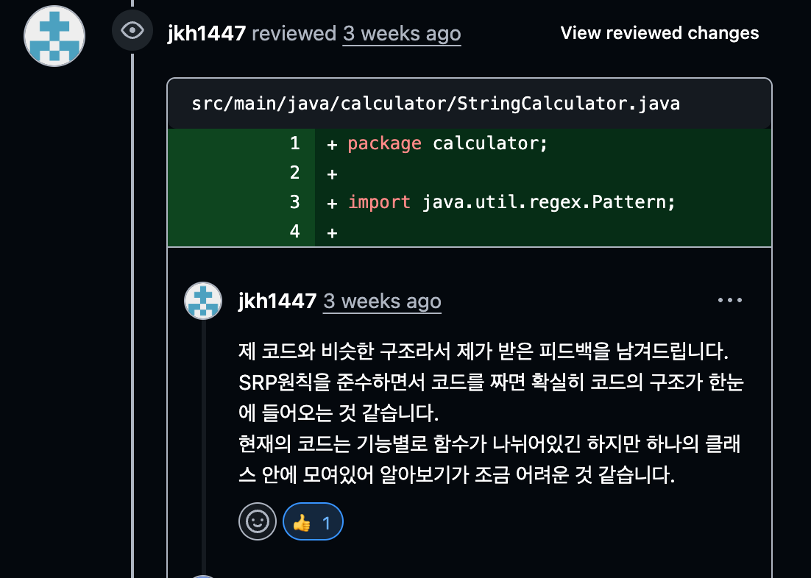

1주차 피드백은 다음과 같았다.

1. 단일 책임 원칙 준수하기
2. 하드코딩하지 않기
3. 복잡한 조건문과 반복문은 메서드로 만들어 사용하기
4. 입력값 검증하기

이것을 기반으로 2주차에서 조금 더 발전한 형태의 코드를 작성할 수 있었다.

# 조금은 긴 소감

목표에도 적었지만, 나는 막학기를 다니며 프리코스에 참여했다. 하지만 다양한 사람들과 함께 성장할 수 있는 기회를 놓칠 수 없었기에, 최대한 프리코스에 시간을 할애하고 싶었다. 

나는 두 가지 방법으로 프리코스에 시간을 할애했다.

1. 절대적 시간을 늘리기
2. 학습의 질을 늘리기

## 1. 절대적 학습 시간을 늘리기

먼저 절대적 시간을 늘리는 방법은 생각보다 간단했다.

첫 번째로, 잠을 줄이면 됐다. 평소에 7시간 반정도 꽤 오랜 시간 자는 편인데, 이번 프리코스에 참여하기 위해 잠을 많이 줄였다. 하루에 3시간 덜 자면서 3시간 공부 시간을 확보했다.

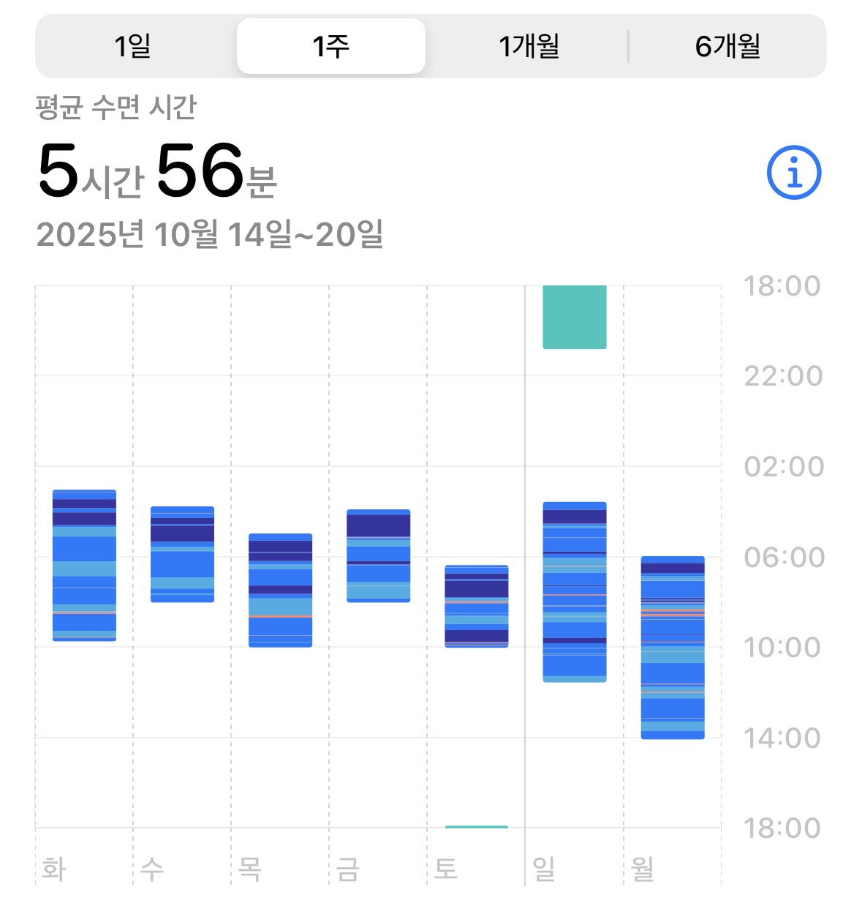

두 번째로, 이동 시간에서도 공부를 하는 것이다. 이전에도 바쁜 기간이 되면 버스에서 노트북을 펼쳐 공부하고는 했다. 학교-집 왕복 시간이 약 2시간 30분정도 되기에, 그 시간을 온전히는 아니어도 활용하고 싶었다.

이 두가지 방법으로 공부 시간을 절대적으로 늘렸다.

## 2. 학습의 질을 늘리기

다음으로 학습 시간의 질을 늘리는 방법은 프리코스 지식 공유자들에게서 많은 힌트와 팁을 얻었다.

### 다른 사람들이 공유하는 지식을 받아들이기

주어진 한정된 시간동안, 효율 높은 공부를 위해서 다른 사람의 지식을 얻는 것이 중요하다고 여겼다. 그래서 가장 먼저 한 것은 프리코스 디스코드의 “함께-나누기” 채널을 확인하는 일이었다.

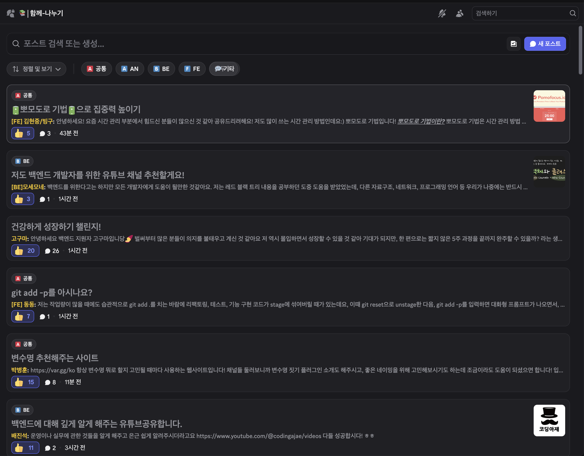

정말 많은 분들이 자신이 아는 것들을 공유해주셨고, 모두 도움 되는 내용들이었다. 이중에서 직접 택한 것들은 다음과 같다.

### 뽀모도로 기법

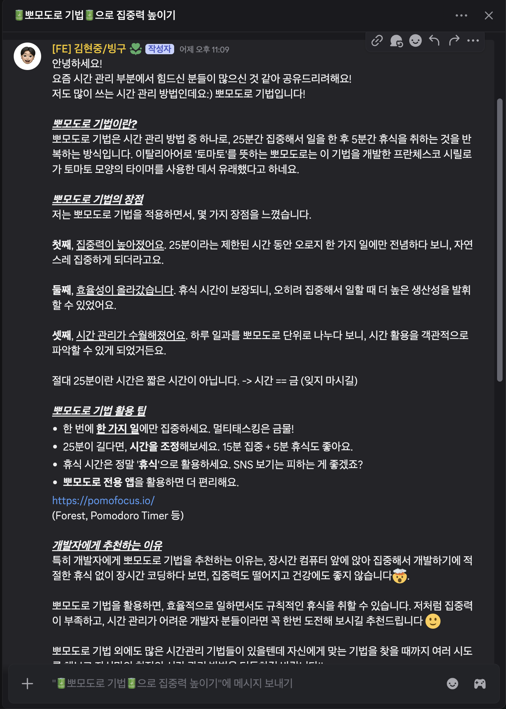

뽀모도로 기법을 소개해주신 프론트엔드의 김현중님께 감사드립니다.

뽀모도로 기법은 25분 동안 집중하여 몰입하고, 이후 5분은 쉬는 시간을 갖는 몰입 기법이다. 이 기법은 7년전 고등학생 때 친구가 뽀모도로 시계를 사용하는 것을 보고 처음 알게 되었다. 

쿠킹 타이머처럼 꽤 귀엽게 생겼다.

이후 공부를 할 때면, 뽀도모도 기법을 사용하기 위해 타이머를 키고 시작했다.

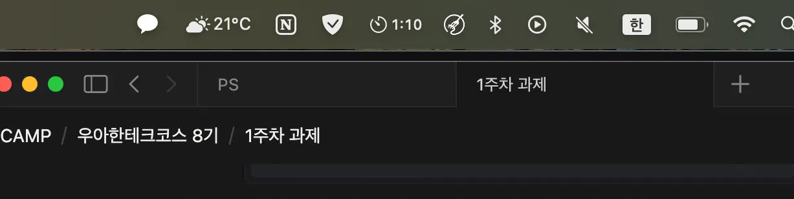

이 글을 쓰는 지금도 사용중이다.

### 개발 유튜브 채널

몇몇 분들이 백엔드와 자바 공부에 도움되는 유튜브 채널들을 소개해주셨다.

모세모네님께서 추천해주신 “쉬운 코드” 영상들이다. 백엔드 개발자에게 필요한 지식들이 정리된 영상들이었다.

[https://www.youtube.com/playlist?list=PLcXyemr8ZeoT-_8yBc_p_lVwRRqUaN8ET](https://www.youtube.com/playlist?list=PLcXyemr8ZeoT-_8yBc_p_lVwRRqUaN8ET)

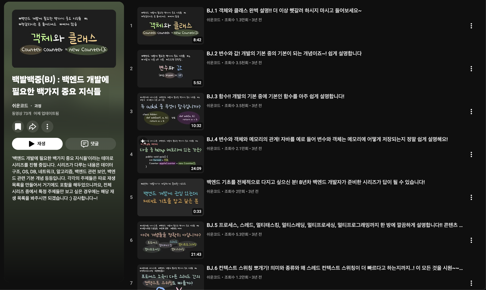

다음으로는 배진석 님께서 추천해주신 “코딩 아재” 채널이다. 현업 개발자의 눈에서 설명하는 것들이니 취업에도 유용해보였다.

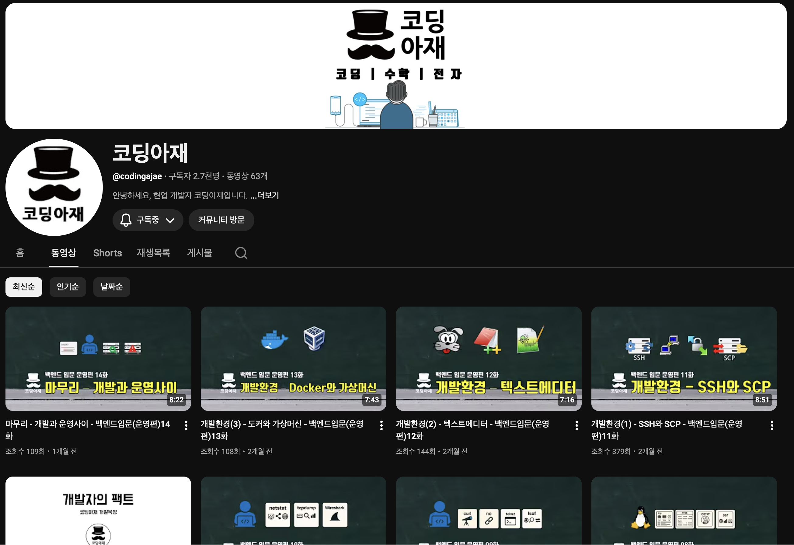

[https://www.youtube.com/@codingajae/videos](https://www.youtube.com/@codingajae/videos)